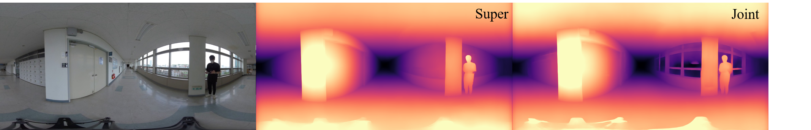

# Joint_360depth

This repository contains the code of the paper 
>"[Improving 360 monocular depth estimation via non-local dense prediction transformer and Joint supervised and self-supervised learning](https://arxiv.org/abs/2109.10563)".  
>
>Ilwi Yun, Hyuk-Jae Lee, Chae Eun Rhee.
>
>AAAI22

Some of our codes are based on the following repositories: [EBS](https://github.com/gdlg/panoramic-depth-estimation), [monodepth2](https://github.com/nianticlabs/monodepth2), [Omnidepth](https://github.com/meder411/OmniDepth-PyTorch), [DPT](https://github.com/isl-org/DPT), [Non-local neural network](https://github.com/AlexHex7/Non-local_pytorch) and baselines ([HoHoNet](https://github.com/sunset1995/HoHoNet),  [Bifuse](https://github.com/Yeh-yu-hsuan/BiFuse), [SvSyn](https://github.com/VCL3D/SphericalViewSynthesis), [Omnidepth](https://github.com/meder411/OmniDepth-PyTorch)).  
We'd like to thank the authors and users providing the codes.

Since this repo is managed/verified by myself, there may be some parts not fully checked in detail when re-organizing the codes for publication. Let me know if there are any problems. 

## Changelog
[2021-10-09 ] Release inference code and pre-trained models   
[2021-12-30 ] Release code for evaluation and additional pre-trained models  
[2022-01-12 ] Release code for training and video data (simple version)
## 1. Setup

This codes are tested under PyTorch (1.7) with a single NVIDIA v100 GPU (418.56, cuda 10.0).


### Installation
#### 1) clone repository
~~~bash
git clone https://github.com/yuniw18/Joint_360depth.git
~~~
#### 2) Set up dependencies
Using Anaconda virtual env, environment can be set as follows.

~~~bash
conda env create --file depth.yaml
conda activate depth_1.7
~~~

## 2. Inreference
#### 1) Download pretrained model

Download the pretrained model from this [link](https://drive.google.com/drive/folders/1IcyB1tgvs_U2KgzAVM9Qo861RmKNCnUd?usp=sharing). 

- Joint_3D60_Hres : model used in the paper (Table 1)
- Joint_3D60_Fres : reproduced model used in the paper (Table 3)
- Super_S3D_Fres & Joint_S3D_Fres : models trained with [Structure3D](https://github.com/bertjiazheng/Structured3D) dataset, which are not used in the paper. 

#### Note on the models
Super_S3D_Fres & Joint_S3D_Fres are additionally trained to support complicated real world scenes with full angular resolutions. Super_S3D_Fres & Joint_S3D_Fres provide similar results except some cases (e.g., window) as shown in the figure below. By refering to the figure & table below, select the model according to the purpose .



The quantitative results in this table are calculated for 360&deg; x 90&deg; image resulutions.

| Model               | Input (angular) resolution  | Joint learning? | Dataset for supervised learning |Matterpot3D abs. rel. |Matterpot3D Sq.rel |Matterpot3D RMS | Matterpot3D delta < 1.25  |
|---------------------|--------------------|----------------|--------------------------|-----------------|------|------|----------------|
| Joint_3D60_Hres     | 128x512 (90&deg;x360&deg;) | Yes   | [3D60](https://github.com/VCL3D/3D60) | 0.0700    | 0.0287     | 0.3032 |0.9599|
| Joint_3D60_Fres     | 512x1024 (180&deg;x360&deg;) | Yes   | [3D60](https://github.com/VCL3D/3D60) | 0.0362  | 0.0127     | 0.1996|0.9845|
| Super_S3D_Fres  |512x1024 (180&deg;x360&deg;) |   No            |[Structure3D](https://github.com/bertjiazheng/Structured3D) | 0.0631    | 0.0400 | 0.3454 |0.9433
| Joint_S3D_Fres|512x1024 (180&deg;x360&deg;) |Yes     | [Structure3D](https://github.com/bertjiazheng/Structured3D) | 0.0642    | 0.0389    | 0.3388   |0.9447


#### 2) To start quickly, go to inference folder & run the following command
Do not use `--Input_Full` option when test 'Joint_3D60_Hres' model
~~~bash
python3 inference_main.py --checkpoint_path [pretrained model path] --Input_Full
~~~
Estimated depths of images in `sample` folder will be saved in the `output` folder

#### 3) To estimate the depths of custom images, run the following command

~~~bash
python3 inference_main.py --data_path [image path] --output_path [path where results will be saved]
~~~
## 3.  Evaluation
To reproduce the results in the paper, find the pre-trained models of each method from their repositories.

#### 1) Download pre-trained models
* Pre-trained Omnidepth model: [rectnet.pth](https://github.com/meder411/OmniDepth-PyTorch)
* Pre-trained SvSyn model : [UD @ epoch 16](https://github.com/VCL3D/SphericalViewSynthesis)
* Pre-trained Bifuse model : [Bifuse_Pretrained.pkl](https://github.com/Yeh-yu-hsuan/BiFuse)
* Pre-trained Hohonet model : [s2d3d_depth_HOHO_depth_dct_efficienthc_TransEn1/ep60.pth](https://github.com/sunset1995/HoHoNet) (for Stanford3D,Stanford data), [mp3d_depth_HOHO_depth_dct_efficienthc_TransEn1/ep60.pth](https://github.com/sunset1995/HoHoNet) (for others)
* Pre-trained Our model : see above

#### 2) Prepare the test dataset
* [3D60 data](https://github.com/VCL3D/3D60) (Stanford3D, Matterport3D, SunCG): Create train/val/test split following their instructuions.   We only use Center view for 3D60 dataset.   Refer to the sample test split of Stanford3D data in 3D60_split folder.
* [Stanford data](https://github.com/alexsax/2D-3D-Semantics): Create train/val/test split following their instructuions. Data folder should be constructed as below. Refer to their repositoiries for more details.

```bash
├── Stanford
   ├── area_n
        ├── rgb
            ├── image.png
        ├── depth
            ├── depth.png
       
``` 
* [Structure3D](https://github.com/bertjiazheng/Structured3D) : Create train/val/test split following their instructuions. Data folder should be constructed as below. Refer to their repositoiries for more details.

```bash
├── Structure3D
   ├── scene_n
        ├── 2D_rendering
            ├── room_number
                ├── panorama
                    ├── full
                        ├── rgb_rawlight.png
                        ├── depth.png
``` 

#### 3) Go to evaluate folder & run the following command
For detailed command options, please refer to `evaluate_main.py` and `eval_script`.

~~~bash
cd evaluate
python3 evaluate_main.py --method [method to be tesetd]  --eval_data [test_data_name] --data_path [test_data_path] --checkpoint_path [checkpoint_path]
~~~
## 4. Training
To train the network, follow the instructions below.

#### 1) Download pre-trained models
For depth network, we recommend to use the model trained with Structure3D dataset as a starting point (Super_S3D_Fres or Joint_S3D_Fres).

For pose network, download the pre-trained models from this [link](https://drive.google.com/drive/folders/1IcyB1tgvs_U2KgzAVM9Qo861RmKNCnUd?usp=sharing). For more details about pose network, refer this [discussions](./README_discussion.md) 

#### 2) Prepare the training data
Download the dataset below you want to use, and split the train/val/test set following the instructinos of each github repo as stated above.

* [3D60 data](https://github.com/VCL3D/3D60)
* [Stanford data](https://github.com/alexsax/2D-3D-Semantics)
* [Structure3D](https://github.com/bertjiazheng/Structured3D)

Recently, [Pano3D](https://github.com/VCL3D/Pano3D), which is an extended version of 3D60 dataset, is released. Consider to use Pano3D, but note that it is not used for experiments in our paper.

Since the video data with original resolution is huge, we provide the simplified version of video data (low resolution, some omitted scenes) for a while. When we reproduce the restuls with the data below, comparable or even better restuls were obtained.  
* [Video data (simple version)](https://drive.google.com/drive/folders/1IcyB1tgvs_U2KgzAVM9Qo861RmKNCnUd?usp=sharing)


#### 3) Check the training options & run the command below
We use smaller learning rate for stable training.
For detailed training options, refer to `main.py` and `train_script`.

~~~bash
python3 main.py --train_data [dataset of supervised learning] --Video --data_path [test_data_path] --video_path [video_data_path] --checkpoint_path [checkpoint_path] --Continue --Crop_data
~~~
## Discussions
* [Discussions on training](./README_discussion.md) 

## To do list
- [x] Code for inference  
- [x] Code for evaluation 
- [x] Code for training
- [x] Video data (simple version)
- [ ] Video data (full version) 

## Citation
```
@article{yun2021improving,
  title={Improving 360 Monocular Depth Estimation via Non-local Dense Prediction Transformer and Joint Supervised and Self-supervised Learning},
  author={Yun, Ilwi and Lee, Hyuk-Jae and Rhee, Chae Eun},
  journal={arXiv preprint arXiv:2109.10563},
  year={2021}
}
``` 
## License
Our contributions on codes are released under the MIT license. For the codes of the otehr works, refer to their repositories.

The video data should only be used for private/research purposes, and not for any commercial purposes.
