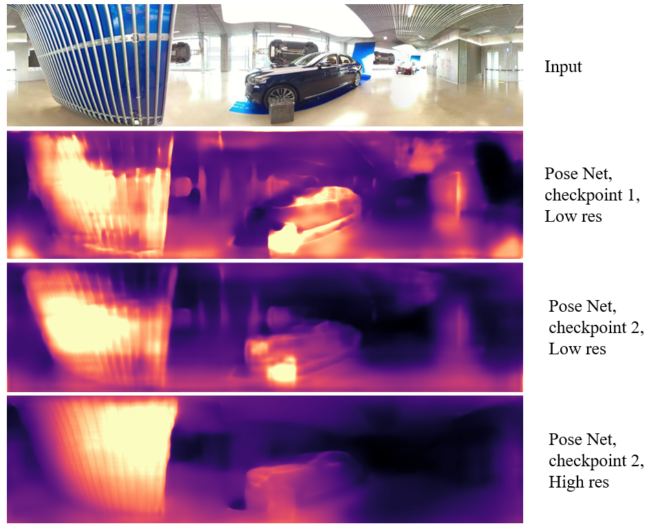

# Discussions on training

Below further discusses our experience on training, which are shortly mentioned in the paper. 

## Self-supervised learning
The performance of depthnet is highly affected by the performance of the posenet, which is expected considering that they influence each other when calculating self-supervised losses. 
If posenet mispredict the camera poses, depthnet must output unaccurate depths to minimize the losses. 
Under the condition where no ground truth poses are availble, however, it is hard to tell whether the camera poses are appropriately estimated, which makes training a challenge.
Figure below briefly shows this, which are experimented using [CNN-based depth network architure](https://github.com/cleinc/bts) with self-supervised learning only.

 
We observe that different esimated poses results in different depht results (row 2,3), while high resolution video input seem to produce more stable depth results (row 4). Note that, we use checkpoint2 posenet and low resolution (256 x 512) video data in our paper. 
In addition, there still exist unresolved problems in self-supervised depth learning, which results in some failure cases (e.g., light reflected area). 
For these reaons, we used self-supervised learning as an assistant of a supervised learning as discussed in the paper. 
If there exists some additional information or methodologies which can manage those problems effectively, further improvements can be achived, which we left to the future. 

## Hyper-parameters
Due to difficulties of self-supervised learning, the weight hyper-parameters between supervised and self-supervised losses affects the performance considerably as similar to GAN and pixel-wise losses on image generations tasks.
We also observe that learning rate affects the stability of the training significantly. 
In addition to them, there exist many hyper-parameters affecting the training progress simultaneously, however, not all of them are anlyzed in detail. 
Therefore, we expect that further improvements can be achived through hyper-parameter searching.   

